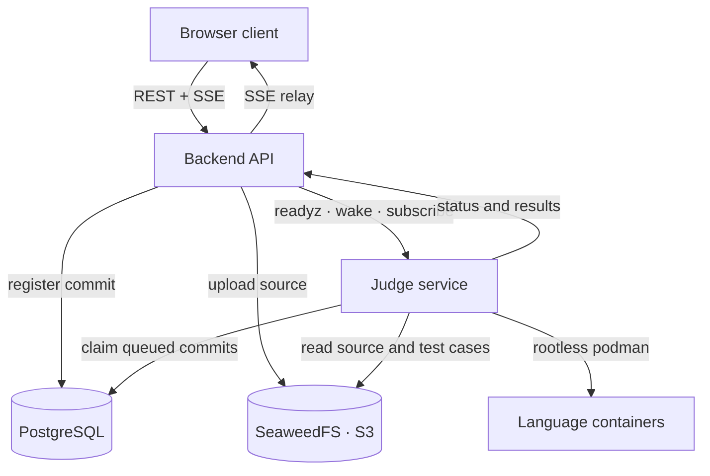

# RunCodes

An open-source platform for programming exercises: students submit code, the
platform compiles and runs it against the exercise's test cases in isolated
containers, and the results are streamed back live.

This repository is the next-generation rewrite of the legacy run.codes platform.
The original compiler engine and language images live in separate repositories
(`compiler-engine`, `compiler-images`); they were folded into this one as
`judge/`, `judge-runners/` and `monitor/`.

## Architecture



A submission flows through the platform like this:

1. The client uploads a source file to the backend.
2. The backend checks that the judge is healthy, uploads the source to S3 and
   registers a `queued` commit. If the judge is unreachable nothing is
   registered, so a submission is never silently lost.
3. The judge claims queued commits from PostgreSQL (at most
   `JUDGE_CONCURRENCY` at a time), downloads the source and test cases from S3,
   and runs the language container.
4. The judge streams status changes, per-test-case verdicts and the final result
   to the backend, which persists everything and relays it to the client over
   SSE. A reloading client reconnects and replays the persisted state.

## Services

| Service     | Path             | Stack                                     | Description                                      |
| ----------- | ---------------- | ----------------------------------------- | ------------------------------------------------ |
| Frontend    | `frontend/`      | React 19, Vite, TypeScript, Tailwind, Bun | The web client.                                  |
| Backend API | `backend/`       | Go, chi, PostgreSQL, JWT, S3              | Auth, courses, submissions, SSE relay.           |
| Judge       | `judge/`         | Go, rootless podman, PostgreSQL, S3       | Compiles, runs and grades submissions.           |
| Runners     | `judge-runners/` | Docker images per language                | The container each submission is graded in.      |
| Monitor     | `monitor/`       | C                                         | Limits, times and reports one graded process.    |
| Database    | `database/`      | PostgreSQL                                | Schema, seed data and the legacy-data migration. |

Each service has its own README: [`backend/README.md`](backend/README.md),
[`frontend/README.md`](frontend/README.md), [`judge/README.md`](judge/README.md),
[`judge-runners/README.md`](judge-runners/README.md),
[`monitor/README.md`](monitor/README.md).
The judge/backend integration contract is documented in
[`judge/DESIGN.md`](judge/DESIGN.md); the judge/image contract (the milestone
nonce and the per-case limits) is in the same file.

## Repository layout

```
.
├── backend/        Go API (auth, offerings, submissions, SSE relay)
├── frontend/       React client served by Caddy
├── judge/          Execution engine (rootless podman)
├── judge-runners/  Language images the judge runs submissions in
├── monitor/        In-container process monitor (limits, timing, report)
├── database/       PostgreSQL schema, seeds and legacy migration
└── docker-compose.yml
```

## Getting started

The whole stack runs with Docker Compose. The judge additionally needs a
**rootless podman** API socket on the host and a directory shared with it (see
[`judge/README.md`](judge/README.md)); Compose creates and prepares `./exec`
automatically, so no manual setup is required there:

```bash
# Rootless podman API socket used by the judge.
systemctl --user start podman.socket

# Required secrets. Compose refuses to start without them: a deployment that
# falls back to a committed or empty default has either a forgeable session key
# or an unauthenticated judge.
export RUNCODES_JWT_SECRET='change-me'
# Two database passwords: `RUNCODES_DB_PASSWORD` belongs to the owner (used by the
# database container and by migrations), `RUNCODES_DB_APP_PASSWORD` to the
# `runcodes_app` role the backend and the judge log in as.
export RUNCODES_DB_PASSWORD='change-me'
export RUNCODES_DB_APP_PASSWORD='change-me'
# Shared bearer token between the backend and the judge. The judge refuses every
# /v1 request while it is unset (see judge/README.md for the local-only escape
# hatch, JUDGE_ALLOW_INSECURE).
export RUNCODES_JUDGE_TOKEN='change-me'
# Credentials for the S3-compatible store that holds submissions and answers.
export RUNCODES_S3_CREDENTIALS_KEY='change-me'
export RUNCODES_S3_CREDENTIALS_SECRET='change-me'

docker compose up --build
```

| Service   | URL                                                             |
| --------- | --------------------------------------------------------------- |
| Frontend  | `http://localhost:8080` (serves the SPA and proxies `/api/*`)   |
| Backend   | reached through the frontend proxy at `/api` (loopback `:8443`) |
| Judge     | `http://localhost:9000` (loopback only)                         |
| SeaweedFS | `http://localhost:8333` (loopback only)                         |
| smtp4dev  | `http://localhost:8081` (loopback only)                         |

Only the frontend is published on a network interface. The judge, SeaweedFS and
smtp4dev are bound to loopback: the backend and the judge talk to each other over
the compose network, so none of them needs to be reachable from outside the host.

The database is seeded with an admin account (`admin@admin.com`) that has **no
password**: a hash committed to this repository would be a published credential.
Set one before the first login — the account cannot be used until you do:

```bash
RUNCODES_ADMIN_PASSWORD='...' \
  PGHOST=localhost PGPORT=5432 PGUSER=runcodes PGDATABASE=runcodes \
  PGPASSWORD="$RUNCODES_DB_PASSWORD" ./database/bootstrap-admin.sh
```

### Configuration

Compose reads secrets from the environment (or a root `.env` file, see
`.env.example`). The most relevant variables are `RUNCODES_JWT_SECRET`,
`RUNCODES_DB_PASSWORD`, `RUNCODES_DB_APP_PASSWORD`,
`RUNCODES_LEGACY_PASSWORD_SALT`, `RUNCODES_JUDGE_TOKEN` and the `RUNCODES_S3_*`
settings; all but the legacy salt are required and compose fails fast when one is
missing. Every service documents its own variables in its `.env.example`.

## Development

Run each service locally against the Compose-provided database, SeaweedFS and
podman socket:

```bash
# Backend (needs a .env or environment variables)
cd backend && go run . -debug

# Judge
cd judge && make run

# Frontend
cd frontend && bun install && bun run dev
```

## Releases

Two image families are consumed by name and are published to GHCR on a
`v*.*.*` tag:

| Workflow                        | Publishes                                                                     |
| ------------------------------- | ----------------------------------------------------------------------------- |
| `.github/workflows/monitor.yml` | `ghcr.io/runcodes-icmc/runcodes-monitor`                                      |
| `.github/workflows/runners.yml` | `ghcr.io/runcodes-icmc/runcodes-runner-base` and `runcodes-runner-<language>` |

Both workflows also move `:latest` on every tag, because that is the tag the
per-language Dockerfiles, the judge's default `JUDGE_IMAGE_FORMAT` and the
integration test read; the version tags exist for pinning a deployment.
`runners.yml` builds `base` before the languages, since 12 of them inherit from
it and 11 copy the harness and the monitor out of it.

That makes the judge, the monitor and the language images one contract (the
milestone nonce and the per-case limits, documented in
[`judge/DESIGN.md`](judge/DESIGN.md)): changing it means releasing the judge and
rebuilding the images in `judge-runners/` together, or the runs of the new judge
fail against images that are still on the old base script.

The application images (backend, frontend, database, judge) are built and
scanned from source by `.github/workflows/images.yml`; they are not published —
`docker compose` builds them locally.

## Security

API surface: only the frontend is published on a network interface. The backend,
the judge, SeaweedFS and smtp4dev are bound to loopback, and the judge refuses
its API unless `RUNCODES_JUDGE_TOKEN` is set. Graded containers get no network
namespace, are capped in memory, PIDs and CPU (`JUDGE_CONTAINER_*`), and cannot
gain privileges through a setuid binary in an image (`no-new-privileges`).

Database: the backend and the judge log in as `runcodes_app`, a role that can
read and write rows and **cannot** change the schema, create roles or read
`pg_authid` (`database/schema/05-app-role.sh`, asserted by CI). Only the database
container and the migration tooling use the superuser the postgres image creates.

Container images and the repository are scanned with [Trivy](https://trivy.dev/)
(configuration in `trivy.yaml`, accepted risks in `.trivyignore`) by the
`Trivy Security Scan` workflow and via `docker compose` builds.

## License

RunCodes is distributed under the **GNU Affero General Public License v3.0** —
see [LICENSE](LICENSE).

## Contributing

Contributions are welcome. Please read [CONTRIBUTING.md](CONTRIBUTING.md) and
see [CONTRIBUTORS.md](CONTRIBUTORS.md) for the people behind the project.
