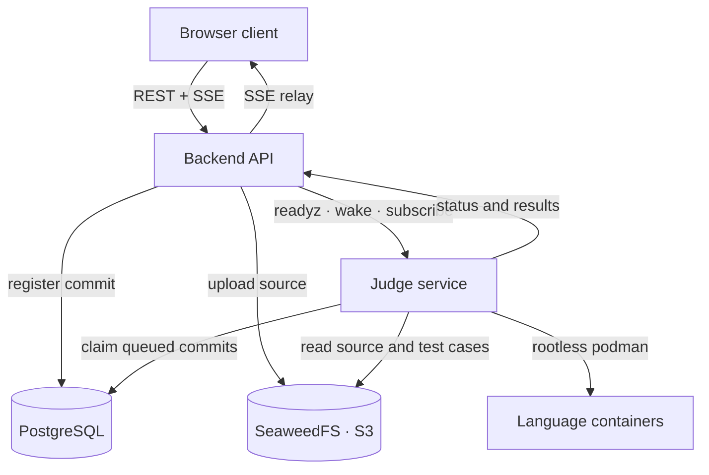

# RunCodes

An open-source platform for programming exercises: students submit code, the
platform compiles and runs it against the exercise's test cases in isolated
containers, and the results are streamed back live.

This repository is the next-generation rewrite of the legacy run.codes platform.
The original compiler engine and language images live in separate repositories
(`compiler-engine`, `compiler-images`).

## Architecture



A submission flows through the platform like this:

1. The client uploads a source file to the backend.
2. The backend checks that the judge is healthy, uploads the source to S3 and
   registers a `queued` commit. If the judge is unreachable nothing is
   registered, so a submission is never silently lost.
3. The judge claims queued commits from PostgreSQL (at most
   `JUDGE_CONCURRENCY` at a time), downloads the source and test cases from S3,
   and runs the language container.
4. The judge streams status changes, per-test-case verdicts and the final result
   to the backend, which persists everything and relays it to the client over
   SSE. A reloading client reconnects and replays the persisted state.

## Services

| Service     | Path        | Stack                                     | Description                                      |
| ----------- | ----------- | ----------------------------------------- | ------------------------------------------------ |
| Frontend    | `frontend/` | React 19, Vite, TypeScript, Tailwind, Bun | The web client.                                  |
| Backend API | `backend/`  | Go, chi, PostgreSQL, JWT, S3              | Auth, courses, submissions, SSE relay.           |
| Judge       | `judge/`    | Go, rootless podman, PostgreSQL, S3       | Compiles, runs and grades submissions.           |
| Database    | `database/` | PostgreSQL                                | Schema, seed data and the legacy-data migration. |

Each service has its own README: [`backend/README.md`](backend/README.md),
[`frontend/README.md`](frontend/README.md), [`judge/README.md`](judge/README.md).
The judge/backend integration contract is documented in
[`judge/DESIGN.md`](judge/DESIGN.md).

## Repository layout

```
.
├── backend/     Go API (auth, offerings, submissions, SSE relay)
├── frontend/    React client served by Caddy
├── judge/       Execution engine (rootless podman)
├── database/    PostgreSQL schema, seeds and legacy migration
└── docker-compose.yml
```

## Getting started

The whole stack runs with Docker Compose. The judge additionally needs a
**rootless podman** API socket on the host and a directory shared with it (see
[`judge/README.md`](judge/README.md)):

```bash
# Rootless podman API socket used by the judge.
systemctl --user start podman.socket

# Required secrets.
export RUNCODES_JWT_SECRET='change-me'
export RUNCODES_DB_PASSWORD='change-me'
# Optional: shared token between the backend and the judge.
export RUNCODES_JUDGE_TOKEN='change-me'

docker compose up --build
```

| Service   | URL                                                             |
| --------- | --------------------------------------------------------------- |
| Frontend  | `http://localhost:8080` (serves the SPA and proxies `/api/*`)   |
| Backend   | reached through the frontend proxy at `/api` (loopback `:8443`) |
| Judge     | `http://localhost:9000`                                         |
| SeaweedFS | `http://localhost:8333`                                         |
| smtp4dev  | `http://localhost:8081`                                         |

The database is seeded with a default admin user (`admin@admin.com`, password
`Admin&1234`) — **change it** before using the platform anywhere real.

### Configuration

Compose reads secrets from the environment (or a root `.env` file, see
`.env.example`). The most relevant variables are `RUNCODES_JWT_SECRET`,
`RUNCODES_DB_PASSWORD`, `RUNCODES_LEGACY_PASSWORD_SALT`, `RUNCODES_JUDGE_TOKEN`
and the `RUNCODES_S3_*` settings. Every service documents its own variables in
its `.env.example`.

## Development

Run each service locally against the Compose-provided database, SeaweedFS and
podman socket:

```bash
# Backend (needs a .env or environment variables)
cd backend && go run . -debug

# Judge
cd judge && make run

# Frontend
cd frontend && bun install && bun run dev
```

## Security

Container images and the repository are scanned with [Trivy](https://trivy.dev/)
(configuration in `trivy.yaml`, accepted risks in `.trivyignore`) by the
`Trivy Security Scan` workflow and via `docker compose` builds.

## License

RunCodes is distributed under the **GNU Affero General Public License v3.0** —
see [LICENSE](LICENSE).

## Contributing

Contributions are welcome. Please read [CONTRIBUTING.md](CONTRIBUTING.md) and
see [CONTRIBUTORS.md](CONTRIBUTORS.md) for the people behind the project.
